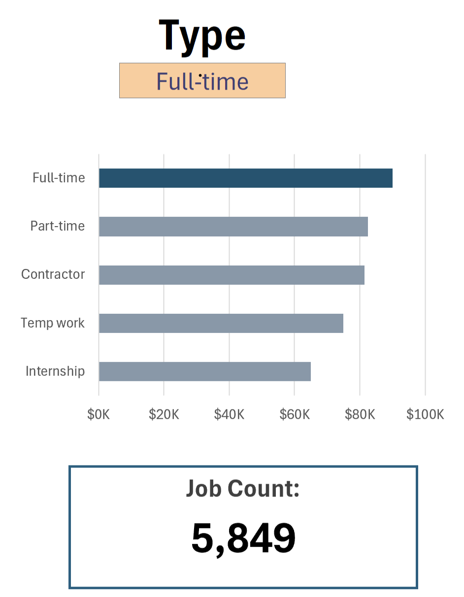
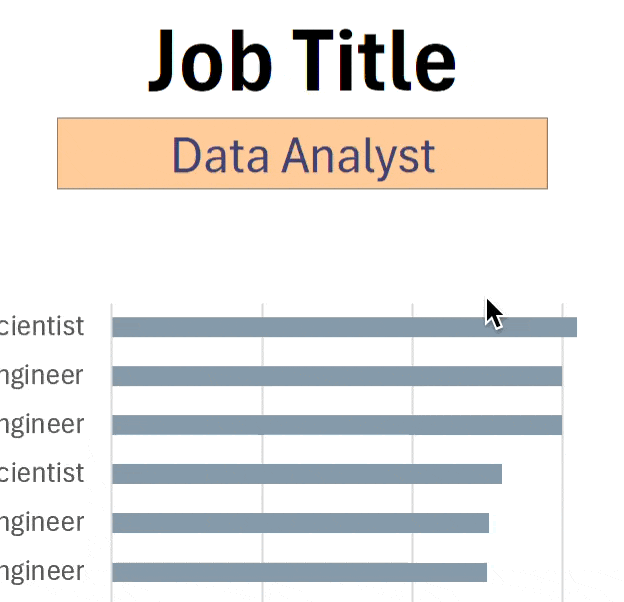

<div align="center">

# 📊 Dashboard de Salarios de Ciencia de Datos

### Panel interactivo para explorar salarios del sector tecnológico

[](https://www.microsoft.com/es-es/microsoft-365/excel)
[]()

---


</div>

---

## 📋 Introducción

Este dashboard de salarios de empleos en ciencia de datos fue creado para ayudar a los buscadores de empleo a investigar salarios de sus puestos deseados y asegurar una compensación adecuada.

Los datos provienen del curso de Excel de Luke Barousse, proporcionando una base para analizar datos usando esta poderosa herramienta. Los datos contienen información detallada sobre títulos de empleos, salarios, ubicaciones y habilidades esenciales.

### 📁 Archivo del Dashboard

El dashboard final se encuentra en: [Proyecto_Data_Analysis_1.xlsx](Proyecto_Data_Analysis_1.xlsx)

---

## 🛠️ Habilidades de Excel Utilizadas

| Categoría | Descripción |
|---|---|
| 📉 **Gráficos** | Gráficos de barras y mapas geográficos |
| 🧮 **Fórmulas y Funciones** | MEDIANA, FILTRAR, ISNUMBER, SEARCH |
| ❎ **Validación de Datos** | Listas desplegables con filtros |

---

## 📊 Datos del Dataset

El dataset contiene información real del mercado laboral de ciencia de datos de 2023, disponible a través del curso de Excel. Incluye:

- 👨‍💼 **Títulos de empleos** — Puestos de trabajo en ciencia de datos
- 💰 **Salarios** — Compensación anual promedio
- 📍 **Ubicaciones** — Países y regiones
- 🛠️ **Habilidades** — Tecnologías y herramientas requeridas

---

## 🔨 Construcción del Dashboard

### 📉 Gráficos

#### 📊 Salarios por Puestos de Trabajo — Gráfico de Barras


- 🛠️ **Funcionalidad de Excel:** Se utilizó la función de gráfico de barras con valores de salario formateados y diseño optimizado.
- 🎨 **Elección de Diseño:** Gráfico de barras horizontal para comparación visual de salarios medianos.
- 📉 **Organización de Datos:** Los títulos de empleo se ordenaron por salario descendente para mejor legibilidad.
- 💡 **Hallazgos Clave:** Permite identificar tendencias salariales, donde los roles Senior y Engineers tienen salarios más altos que los Analyst.

---

#### 🗺️ Salarios Medianos por País — Gráfico de Mapa


- 🛠️ **Funcionalidad de Excel:** Se utilizó la función de mapa de Excel para representar salarios medianos globalmente.
- 🎨 **Elección de Diseño:** Mapa codificado por colores para diferenciar niveles salariales por regiones.
- 📊 **Representación de Datos:** Se graficó el salario mediano de cada país con datos disponibles.
- 💡 **Hallazgos Clave:** Permite comprender rápidamente las disparidades salariales globales y las regiones con salarios altos/bajos.

---

### 🧮 Fórmulas y Funciones

#### 💰 Salario Mediano por Títulos de Empleo

```excel
=MEDIAN(
IF(
    (jobs[job_title_short]=A2)*
    (jobs[job_country]=country)*
    (ISNUMBER(SEARCH(type,jobs[job_schedule_type])))*
    (jobs[salary_year_avg]<>0),
    jobs[salary_year_avg]
)
)
```

- 🔍 **Filtrado Multi-Criterio:** Verifica título de empleo, país, tipo de horario y excluye salarios vacíos.
- 📊 **Fórmula de Matriz:** Utiliza la función `MEDIAN()` con una declaración `IF()` anidada para analizar un array.
- 🎯 **Información Personalizada:** Proporciona información salarial específica para títulos, regiones y tipos de empleo.

📋 **Tabla de Fondo:**


📉 **Implementación en Dashboard:**


---

#### ⏰ Conteo por Tipo de Horario Laboral

```excel
=FILTER(J2#,(NOT(ISNUMBER(SEARCH("and",J2#))+ISNUMBER(SEARCH(",",J2#))))*(J2#<>0))
```

- 🔍 **Generación de Lista Única:** Utiliza la función `FILTER()` para excluir entradas que contienen "and" o comas, y omitir valores cero.
- **🔢 Propósito de la Fórmula:** Genera una lista de tipos de horario laboral únicos para validación de datos.

📋 **Tabla de Fondo:**


📉 **Implementación en Dashboard:**



---

### ❎ Validación de Datos

#### 🔍 Lista Filtrada

- 🔒 **Validación de Datos Mejorada:** Implementar la lista filtrada como regla de validación de datos bajo las opciones `Título de Empleo`, `País` y `Tipo` en la pestaña de Datos garantiza:
  - 🎯 La entrada del usuario está restringida a tipos de horario predefinidos y validados
  - 🚫 Se previenen entradas incorrectas o inconsistentes
  - 👥 Se mejora la usabilidad general del dashboard



---

## 📝 Conclusión

Creé este dashboard para mostrar información sobre las tendencias salariales en varios títulos de empleos relacionados con datos. Utilizando datos del curso de Excel, este dashboard permite a los usuarios tomar decisiones informadas sobre sus trayectorias profesionales. Las funcionalidades permiten entender cómo la ubicación y el tipo de empleo influyen en los salarios.

---

<div align="center">

[⬅️ Volver al Repositorio Principal](../README.md)

</div>
