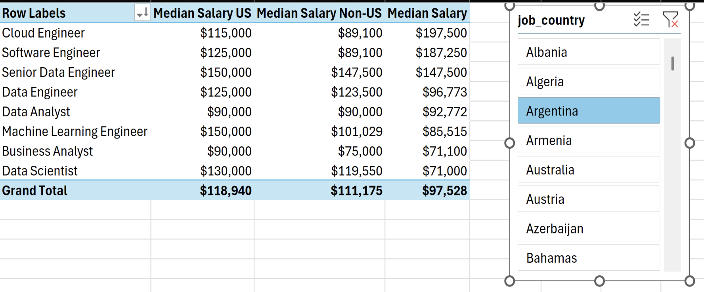
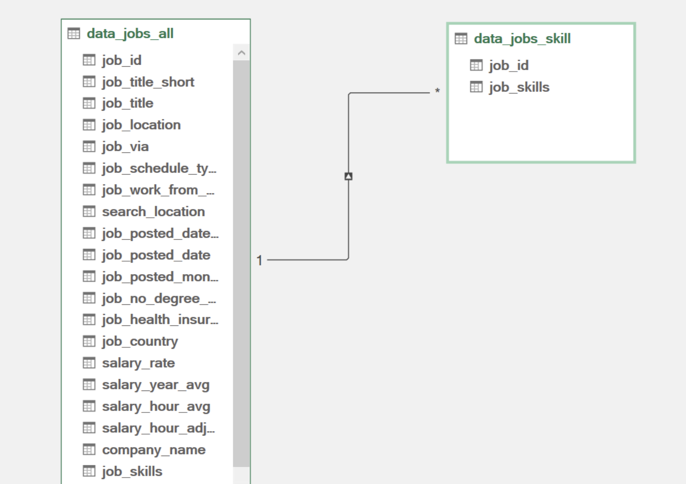

<div align="center">

# 📊 Análisis del Mercado Laboral en Ciencia de Datos

### Análisis completo de empleos, salarios y habilidades demandadas

[](https://www.microsoft.com/es-es/microsoft-365/excel)
[]()
[]()

---

</div>

---

## 📋 Introducción

Como buscador de empleo anterior, siempre me ha sorprendido la falta de datos que exploren los empleos y habilidades más óptimas en el mercado de ciencia de datos. Me propuse entender qué habilidades solicitan los principales empleadores y cómo conseguir mejor remuneración.

### ❓ Preguntas de Análisis

Para entender el mercado laboral de ciencia de datos, formulé las siguientes preguntas:

1. **¿Más habilidades significan mejor salario?**
2. **¿Cuál es el salario de los empleos de datos en diferentes regiones?**
3. **¿Cuáles son las habilidades principales de los profesionales de datos?**
4. **¿Cuál es la remuneración de las 10 habilidades principales?**

---

## 🛠️ Habilidades de Excel Utilizadas

| Categoría | Descripción |
|---|---|
| 📊 **Tablas Dinámicas** | Resúmenes y agrupaciones de datos |
| 📈 **Gráficos Dinámicos** | Visualización de datos pivot |
| 🧮 **DAX** | Expresiones de análisis de datos |
| 🔍 **Power Query** | Extracción y transformación ETL |
| 💪 **Power Pivot** | Modelos de datos relacionales |

---

## 📊 Datos del Dataset

El dataset contiene información real del mercado laboral de ciencia de datos de 2023, disponible a través del curso de Excel. Incluye:

- 👨‍💼 **Títulos de empleos** — Puestos de trabajo en ciencia de datos
- 💰 **Salarios** — Compensación anual promedio
- 📍 **Ubicaciones** — Países y regiones
- 🛠️ **Habilidades** — Tecnologías y herramientas requeridas

---

## 1️⃣ ¿Más habilidades significan mejor salario?

### 🔍 Habilidad: Power Query (ETL)

#### 📥 Extraer

- Primero utilicé Power Query para extraer los datos originales (`data_salary_all.xlsx`) y crear dos consultas:
  - 🗃️ Una con toda la información de empleos de datos
  - 🔧 La segunda listando las habilidades para cada ID de empleo

#### 🔄 Transformar

- Luego transformé cada consulta cambiando tipos de columnas, eliminando columnas innecesarias, limpiando texto y recortando espacios en exceso

📋 **Consulta data_jobs_all:**


📋 **Consulta data_job_skills:**


#### 🔗 Cargar

- Finalmente, cargué ambas consultas transformadas en el libro de trabajo

📊 **Carga data_jobs_all:**


🛠️ **Carga data_job_skills:**


---

### 📊 Análisis

#### 💡 Hallazgos Clave

- 📈 Existe una **correlación positiva** entre el número de habilidades solicitadas en las ofertas de empleo y el salario mediano, especialmente en roles como Senior Data Engineer y Data Scientist.
- 💼 Roles que requieren menos habilidades, como Business Analyst, tienden a ofrecer salarios más bajos, lo que sugiere que los conjuntos de habilidades más especializados tienen mayor valor de mercado.


#### 🤔 ¿Qué significa esto?

Esta tendencia enfatiza el valor de adquirir múltiples habilidades relevantes, particularmente para personas que buscan roles mejor remunerados.

---

## 2️⃣ ¿Cuál es el salario en diferentes regiones?

### 🧮 Habilidades: Tablas Dinámicas y DAX

#### 📈 Tabla Dinámica

- 🔢 Creé una Tabla Dinámica usando el Modelo de Datos creado con Power Pivot
- 📊 Moví `job_title_short` al área de filas y `salary_year_avg` al área de valores
- 🧮 Luego agregué una nueva medida para calcular el salario mediano de empleos en Estados Unidos

```dax
Median Salary := MEDIAN(data_jobs_all[salary_year_avg])
```

#### 🧮 DAX — Salario Mediano por País

```dax
=CALCULATE(
    MEDIAN(data_jobs_all[salary_year_avg]),
    data_jobs_all[job_country] = "United States")
```

---

### 📊 Análisis

#### 💡 Hallazgos Clave

- 💼 Roles como **Senior Data Engineer** y **Data Scientist** comandean salarios medianos más altos tanto en EE.UU. como internacionalmente, demostrando la demanda global de experiencia en datos de alto nivel.
- 💰 La disparidad salarial entre roles en EE.UU. y fuera es particularmente notable en trabajos de alta tecnología, influenciada por la concentración de industrias tech en EE.UU.



#### 🤔 ¿Qué significa esto?

Estos datos salariales son importantes para la planificación y negociación de salarios, ayudando a profesionales y empresas a alinear sus ofertas con los estándares del mercado considerando variaciones geográficas.

---

## 3️⃣ ¿Cuáles son las habilidades principales?

### 🔧 Habilidad: Power Pivot

#### 💪 Power Pivot

- 🔗 Creé un modelo de datos integrando las tablas `data_jobs_all` y `data_jobs_skills`
- 🧹 Dado que ya había limpiado los datos con Power Query, Power Pivot creó una relación entre ambas tablas

#### 🔗 Modelo de Datos

Creé una relación entre las dos tablas usando la columna `job_id`:



#### 📃 Menú Power Pivot

El menú de Power Pivot se utilizó para refinar el modelo de datos y facilitar la creación de medidas:


---

### 📊 Análisis

#### 💡 Hallazgos Clave

- 💻 **SQL y Python** dominan como habilidades principales en empleos de datos, reflejando su rol fundamental en procesamiento y análisis de datos.
- ☁️ Tecnologías emergentes como **AWS** y **Azure** también muestran presencia significativa, subrayando el cambio de la industria hacia servicios en la nube y big data.


#### 🤔 ¿Qué significa esto?

Entender las habilidades prevalentes en la industria no solo ayuda a los profesionales a mantenerse competitivos, sino que también guía a los programas educativos para enfocarse en las tecnologías con mayor impacto.

---

## 4️⃣ ¿Cuál es la remuneración de las 10 habilidades principales?

### 📊 Habilidad: Gráficos Avanzados (Pivot Chart)

#### 📈 PivotChart

Creé un PivotChart combinado para graficar el salario mediano y la probabilidad de habilidad (%) de mi Tabla Dinámica:

- 🪙 **Eje Primario:** Salario Mediano (como Columnas Agrupadas)
- 👍 **Eje Secundario:** Probabilidad de Habilidad (como Línea con Marcadores)

Para personalizar el gráfico, agregué títulos, eliminé líneas y cambié los marcadores a diamantes.

---

### 📊 Análisis

#### 💡 Hallazgos Clave

- 💰 Los **salarios medianos más altos** están asociados con habilidades como Python, Oracle y SQL, sugiriendo su rol crítico en empleos tech de alta remuneración.
- 📉 Habilidades como PowerPoint y Word tienen los salarios medianos y la probabilidad más bajos, indicando menor especialización y demanda en sectores de alto salario.


#### 🤔 ¿Qué significa esto?

Este gráfico destaca la importancia de invertir tiempo en aprender habilidades de alto valor como Python y SQL, que están evidemente vinculadas a roles mejor remunerados, especialmente para quienes buscan maximizar su salario en la industria tecnológica.

---

## 📝 Conclusión

Como entusiasta de los datos y ex buscador de empleo, emprendí este proyecto basado en Excel para descubrir información valiosa sobre el mercado laboral de ciencia de datos. Utilizando un dataset de ofertas de empleo reales, analicé títulos, salarios, ubicaciones y habilidades esenciales.

Mediante el uso de funcionalidades de Excel como **Power Query**, **Tablas Dinámicas**, **DAX** y **gráficos**, descubrí correlaciones clave entre múltiples habilidades y salarios más altos, particularmente en **Python**, **SQL** y tecnologías en la nube.

Espero que este proyecto sirva como una guía práctica para profesionales de datos y proporcione una visión de las habilidades necesarias para roles mejor remunerados.

---

<div align="center">

[⬅️ Volver al Repositorio Principal](../README.md)

</div>
